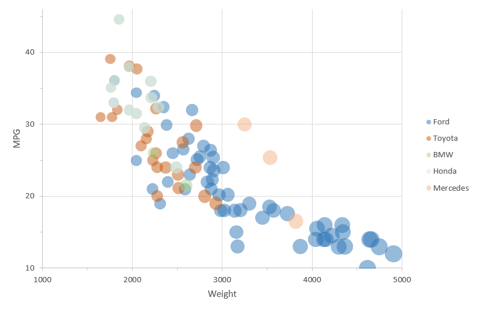
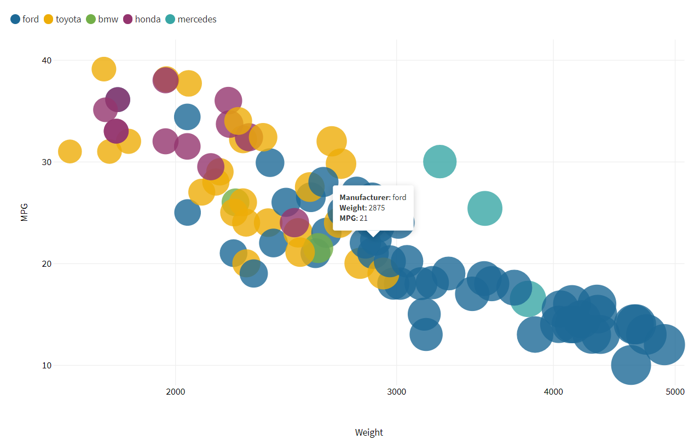
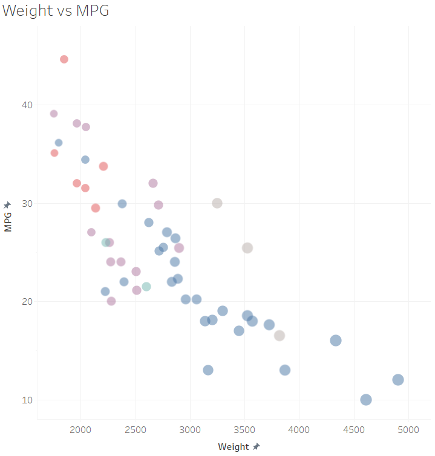
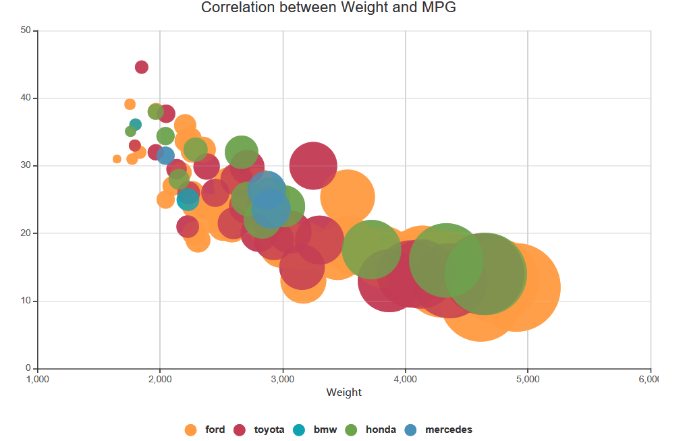
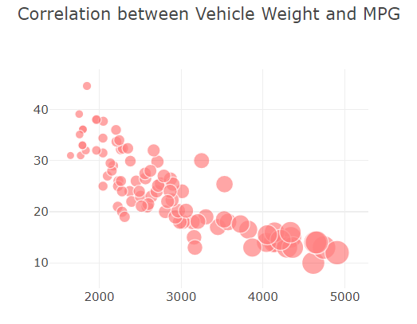
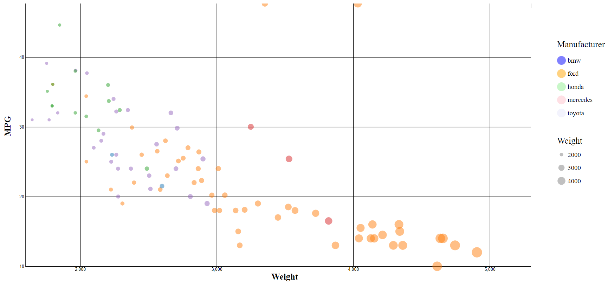
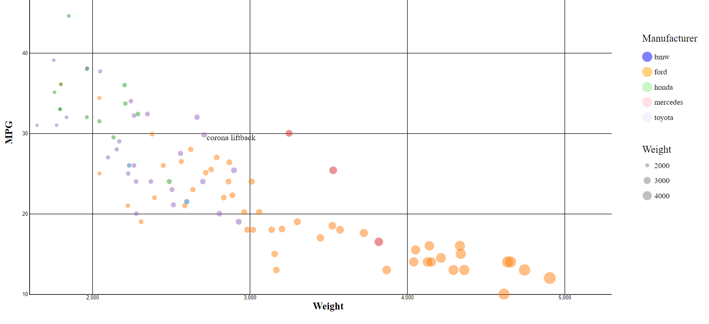

# 02-DataVis-7ways

Assignment 2 - Data Visualization, 7 Ways  
===

# R + ggplot2 + R Markdown + Plotly

This combination of tools allows for clear and minimalistic graphs in just a few lines lines of code. I used ggplot to create the basic graph, and ggplotly() to create the hover effect. By hovering over any data point, the type of car is displayed. I found this to be the simplest tool in terms of accessing data, and can see this being useful for managing large datasets.

.png)

# Excel

Excel was relatively easy to use, as you can insert a variety of charts in the same tool that the data is loaded, and simply highlight columns you want to represent in your visualization. I manipulated the data to get the color mapping to work by separating data by manufacturer.

# Flourish

Flourish is an easy-to-use, code-free data visualization tool centered around business. However, with its simplicity comes limitations. For example, the legend could only be placed above or below the visualization, and could not be to the right or left. While the legend has limitation, it was quick and easy to produce. Another great feature is that when the user hovers over data points, the data used will appear. Additionally, these data visualizations may be posted publicly, which makes them easy for sharing. My visualization is posted here: https://public.flourish.studio/visualisation/1320765/

# Tableau

Tableau is a popular, interactive, business intelligence platform. Although I didn't utilize this feature, it is nice that is provides so many options for easy data aggregation. It was nice that data displayed in hover is done automatically, and that the legend is easy to generate. In this visualization, I assigned colors to data points based on the colors in its logo, with the exception of Toyota, which I assigned purple as all the other colors were taken. Furthermore, I ran into a problem where I couldn't remove the rows with "N/A" values after the data had been uploaded and I'd already been working on it, but then I discovered Tableau's nifty tool to exclude certain data points.

# Visual Paradigm

Visual Paradigm is a UML CASE Tool supporting UML 2, SysML and Business Process Modeling Notation. I found the software quite clunky and difficult to navigate, yet the outcome came out pretty good. The stable release of this product was only in 2018, so while it functions the way it is intended, it's likely that it's still being developed for user intuition and aesthetics. One thing I found odd was that it saves in 3 separate files, 2 of which appear to be unimportant, and you may need to have the software downloaded to open the main file, making it poor for sharing. However, there are some cool features, like the ability edit the data sheet from Visual Paradigm after the file has been uploaded.

# Javascript + Plotly

Plotly is an open source graphing library, which is available for several languages, but I implemented with Javascript. I loaded the data for weight, MPG, and manufacturer into three separate arrays using a for loop, and mapped the size using the map() function. I found it difficult to utilize Plotly for a large dataset that comes from an outside file, as all examples I could find online involving size and color mapping had only a few data points, which were created in arrays by simply assigning values within the program.

# d3

D3.js is a powerful and dynamic tool for generating data visualizations in web browsers. This is a great tool for skilled professionals to create complex visualizations, an may not be ideal for people with little experience to create quick graphics. 

## Technical Achievements
- In my graph done by R + ggplot2 + R Markdown + Plotly, hovering over a data point will display the type of Car.
- Hovering over a data point in d3 will immediately display the type of car that data point represents. This text appears right next to the data point, and disappears as soon as the mouse leaves its position.
- Axis dimensions in d3 are identical to example

### Design Achievements
- My color scheme in Tableau is intended to be user intuitive, as I drew colors from the car manufacturers' logos to enable associativity.
- Implemented legends for manufacturer and weight in d3
- Every visualizations' data points have an opacity of 50%
- Included axis titles and overall graph titles in several visualizations
- Implemented legends
- Axis titles in d3
